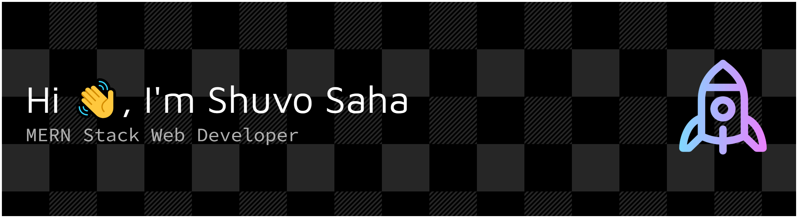

<!-- Banner (clickable LinkedIn link) -->

<h1 align="center">🚀 Turning Ideas into Scalable Web Apps</h1>

---

## 🧑‍💻 About Me

💡 Passionate **MERN Stack Web Developer** with a knack for building **high-performance**, **responsive**, and **user-focused** web applications.  
🎯 I thrive on turning **complex problems into elegant solutions**, blending **clean code** with **eye-catching UI**.  
🌱 Always learning the latest in **JavaScript ecosystems** to stay ahead in the fast-paced tech world.  
🤝 Open to **collaborations**, **freelance projects**, and exciting new challenges.

---

## 🔥 Current Focus

- 🔭 Exploring **Next.js** for SSR & SSG web apps.
- ⚡ Building full-stack projects that solve real-world problems.
- 🛠 Improving **UI/UX** and **accessibility** in every project.

---

## 🛠 Tech & Tools

### **Frontend**

### **Backend**

### **Tools & Platforms**

---

## 📊 GitHub Stats

  
  

---

## 🌐 Connect With Me

  [-000000?style=for-the-badge&logo=x&logoColor=white>)](https://x.com/a1shuvo)

📍 **Location:** Mymensingh-2250, Bangladesh  
✉️ **Email:** [a1shuvosaha@gmail.com](mailto:a1shuvosaha@gmail.com)  
📱 **Phone:** +8801725062049

---

⭐️ _If you like my work, consider giving a star to my repositories!_
